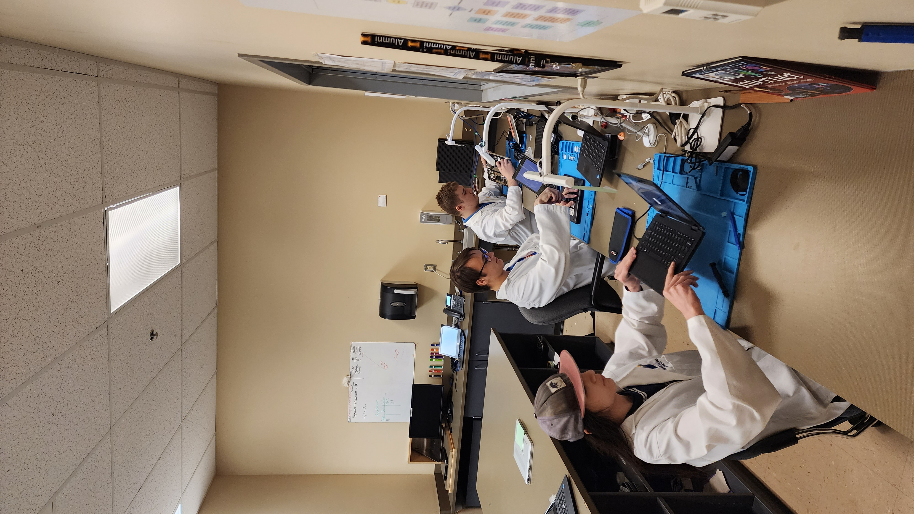
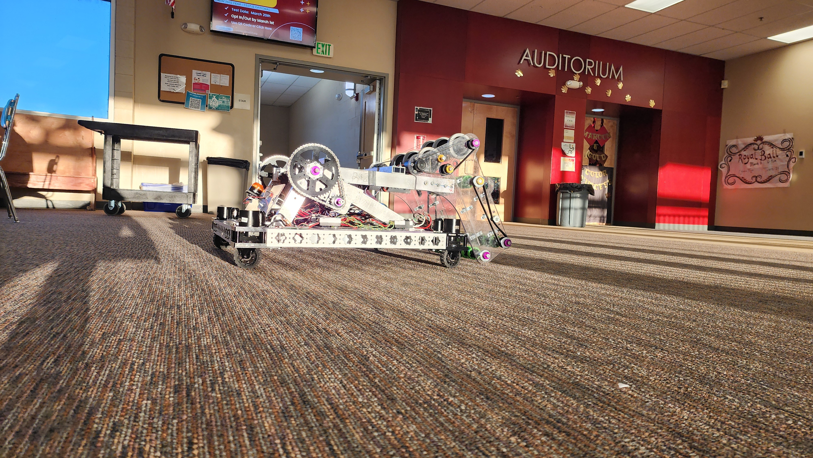
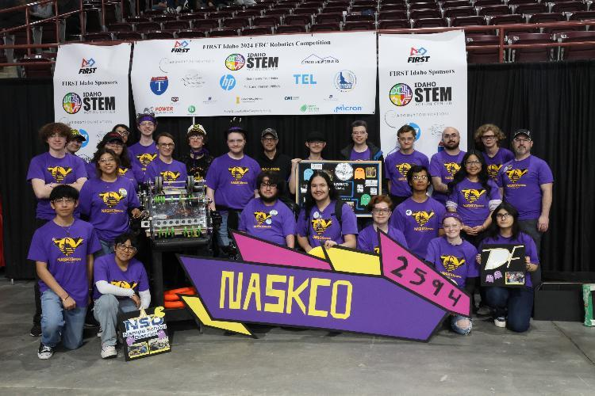
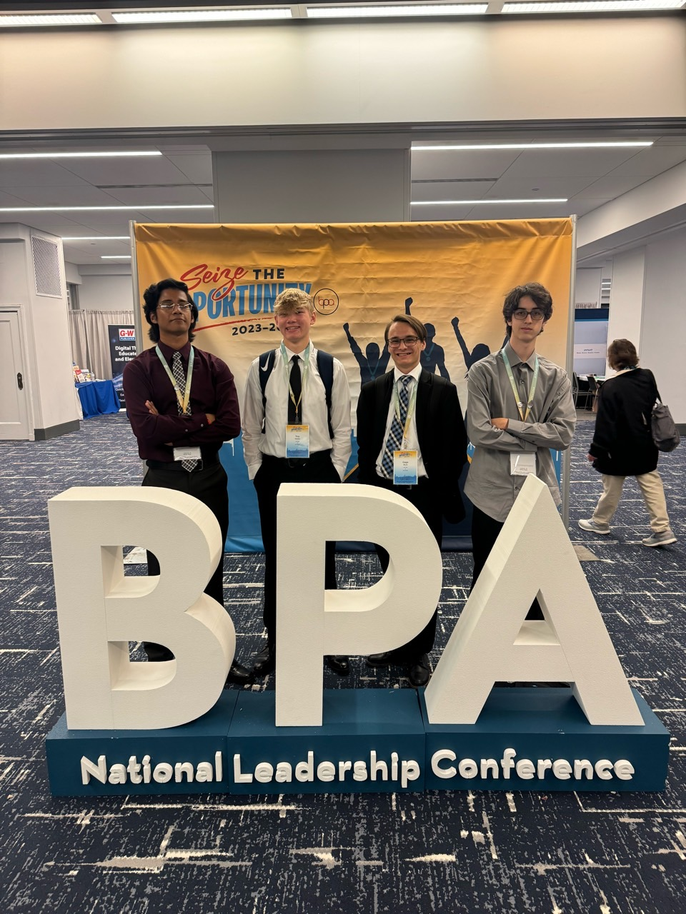

# Who is Gage 🤔

Just a student making his way through college and through the world. 

## Hobbies
- Building Legos
- Gaming
- Programming
- Paddle Boarding
- Air Hockey
- Robotics  
 
## University
I am a student at Boise State University majoring in Computer Science with an emphasis in Cybersecurity. By credits I am a sophomore however this is still only my second semester in college. 

## Professional Life 
Up until this point, I have worked for three different employers including: 

### Boise State Cyberdome (2025)
I was recently hired into the Cyberdome as a Cybersecurity Analyst on work study. 

### Nampa School District (2021-2024)
With NSD I helped to maintain roughly 14,000 devices ranging from iPads to HP laptops. I was initially a summer intern for NSD during the summer of my freshman year. Initially all I did was reimage devices but as time passed I was eventually promoted to a new piolet program. 

The Self Maintainer Program: 
During my junior year I was 1 of 3 students selected for this amazing opportunity where I became a certified apprentice through IBE as well as a HP certified technician. In this position I was able to develop my leadership skills as well as my technical skills.  

## High School Life 
At the start of high school it felt as though I was completely unknown however by the end I was quite busy and well known. 

### Robotics
In high school I was a part of the FRC robotics team known as NASKCO (2594) based out of Nampa Idaho. Originally just a member I eventually took up leadership becoming the electrical lead, then the technical co-captain all the way to now where I still go back as a mentor. 

### BPA
Although I only did BPA my senior year of high school, I found some pretty great success in it and placed top 6 for Device Troubleshooting and Configuration as well as Java Programming in the entire state of Idaho which meant that I got to go to Nationals in Chicago. 

Chicago:
Not a whole lot to say here besides it was an amazing time and great way to cap off my high school career.  

### Graduation
I graduated 4/300 students from Columbia High School in 2024. I also just so happen to have the most items around my neck out of anyone in my district. 

